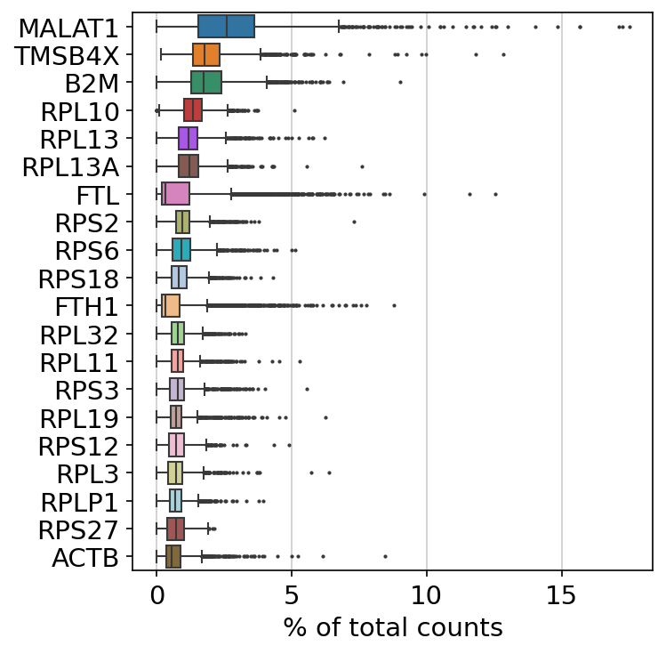
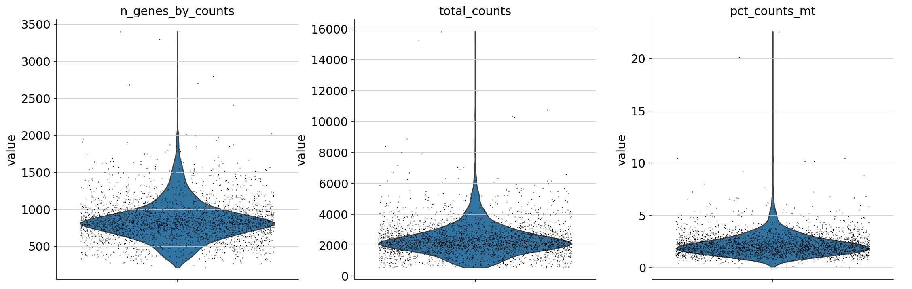
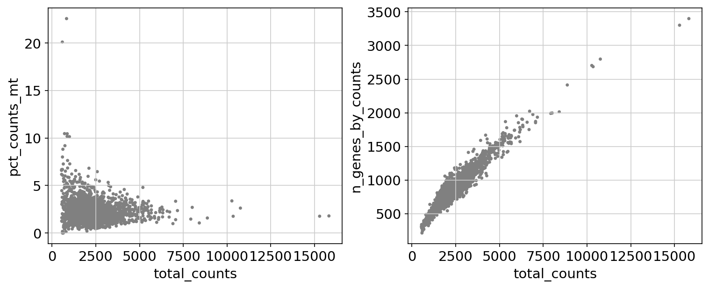
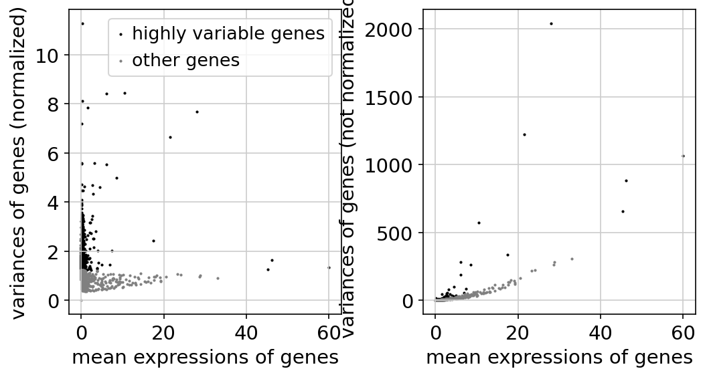

# Group Project: Project 2 Group 2b: Single-Cell RNA Analysis

## Preparation
- **GitHub Setup**
  - Team members: YoungJu Jeon (Preprocessing and Quality Control), Berke Sahbazoglu (Dimensionality Reduction and Clustering), Luxurie Mills (Cell Type Annotation), Christian Gifueroa-Perez (Differential Expression (DE) Analysis)

```bash
/usr/bin/python3 -m venv scanpy_env

source scanpy_env/bin/activate

pip install --upgrade pip setuptools wheel

pip install scanpy

python -m pip install scikit-misc
```


```bash
mkdir -p data write
cd data
test -f pbmc3k_filtered_gene_bc_matrices.tar.gz || curl https://cf.10xgenomics.com/samples/cell/pbmc3k/pbmc3k_filtered_gene_bc_matrices.tar.gz -o pbmc3k_filtered_gene_bc_matrices.tar.gz
tar -xzf pbmc3k_filtered_gene_bc_matrices.tar.gz
```


```bash
#Enable future-style type annotations
from __future__ import annotations
#Import matplotlib for plotting and visualization
import matplotlib.pyplot as plt
#Import pandas for data manipulation (used indirectly in Scanpy workflows)
import pandas as pd
#Import Scanpy, the main library for single-cell RNA-seq analysis
import scanpy as sc
import warnings
warnings.filterwarnings("ignore")

## Setting for scanpy
#Set Scanpy logging verbosity level
#0 = errors only, 1 = warnings, 2 = info, 3 = detailed hints
#Using a higher level helps track what Scanpy is doing internally
sc.settings.verbosity = 0


#Set default figure parameters for Scanpy-generated plots
#dpi controls resolution, facecolor sets background color
sc.set_figure_params(dpi=80, facecolor="white")

#Print Scanpy version and system information for reproducibility
sc.logging.print_header()

#Define the directory where all figures generated by Scanpy will be saved
sc.settings.figdir = "/home/StudentFirst/git/BIOT670I-Group_Project/write/figures"

#Define the output file to store the processed AnnData object
#the file that will store the analysis results
results_file = "write/pbmc3k.h5ad"  

# 1. Load the data
#Read in the 10X Genomics formatted gene expression matrix
#This loads the filtered feature-barcode matrix (counts data)
adata = sc.read_10x_mtx(
    "data/filtered_gene_bc_matrices/hg19/",  # the directory with the `.mtx` file
    var_names="gene_symbols",  # use gene symbols for the variable names (variables-axis index)
    cache=True,  # write a cache file for faster subsequent reading
)

#Print a summary of the AnnData object (cells × genes)
print("Original Data info:")
print(adata, '\n')

#Ensure gene names are unique to avoid downstream conflicts
adata.var_names_make_unique()  # this is unnecessary if using `var_names='gene_ids'` in `sc.read_10x_mtx`


# 2. Preprocessing
#Plot the genes with the highest total expression across all cells
#To show those genes that yield the highest fraction of counts in each single cell, across all cells.
sc.pl.highest_expr_genes(adata, n_top=20, save=".png")
```



```bash
#Filter out cells with very few detected genes
sc.pp.filter_cells(adata, min_genes=200)  # this does nothing, in this specific case

#Filter out genes that are detected in very few cells
sc.pp.filter_genes(adata, min_cells=3)

#Print updated AnnData dimensions after filtering
print("After filtering data: ")
print(adata, '\n')

#Annotate mitochondrial genes
#annotate the group of mitochondrial genes as "mt"
adata.var["mt"] = adata.var_names.str.startswith("MT-")

#Calculate quality control (QC) metrics that includes total counts, number of genes, and mitochondrial gene percentages
sc.pp.calculate_qc_metrics(adata, qc_vars=["mt"], percent_top=None, log1p=False, inplace=True)

#Visualize QC metrics using violin plots, this helps to decide filtering thresholds for low-quality cells
sc.pl.violin(
    adata,
    ["n_genes_by_counts", "total_counts", "pct_counts_mt"],
    jitter=0.4,
    multi_panel=True, save="_plot.png"
)
```



```bash
#To create scatter plots for QC relationships
fig, axs = plt.subplots(1, 2, figsize=(10, 4), layout="constrained")
sc.pl.scatter(adata, x="total_counts", y="pct_counts_mt", show=False, ax=axs[0])
sc.pl.scatter(adata, x="total_counts", y="n_genes_by_counts", show=False, ax=axs[1], save=".png");
```



```bash
#To filter cells based on QC thresholds that remove cells with too many genes, too few genes, or high mitochondrial content
adata = adata[
    (adata.obs.n_genes_by_counts < 2500) & (adata.obs.n_genes_by_counts > 200) & (adata.obs.pct_counts_mt < 5),
    :,
].copy()

#To store raw counts in a separate layer for later use
adata.layers["counts"] = adata.X.copy()

#Print AnnData summary after QC filtering
print("After QC filtering:")
print(adata, '\n')


#Normalize total counts per cell to a fixed value (10,000)
sc.pp.normalize_total(adata, target_sum=1e4)

#Log-transform the normalized data that makes gene expression distributions more comparable
sc.pp.log1p(adata)

#Identify highly variable genes (HVGs), HVGs capture the most biologically informative variation
v_genes = sc.pp.highly_variable_genes(adata, layer="counts", n_top_genes=2000, min_mean=0.0125, max_mean=3, min_disp=0.5, flavor="seurat_v3")

#Plot highly variable genes
sc.pl.highly_variable_genes(adata, save =".png")
```



```bash
#Store scaled data in a separate layer
#Scaling is done after regressing out unwanted technical effects
adata.layers["scaled"] = adata.X.toarray()

#Regress out technical covariates such as sequencing depth and mitochondrial content
sc.pp.regress_out(adata, ["total_counts", "pct_counts_mt"], layer="scaled")

#Scale the data to unit variance and cap extreme values
sc.pp.scale(adata, max_value=10, layer="scaled")

print("QC filtering DONE!")
```
